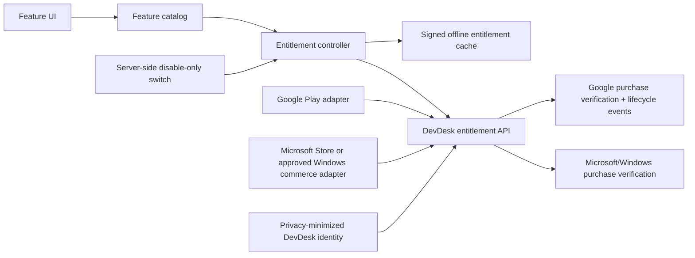

# DevDesk Multi-Theme, Responsive UI, and Future Pro Roadmap

**Status:** Implemented for the Free release; owner/store prerequisites remain  
**Prepared:** 22 July 2026  
**Release targets:** Android and Windows  
**Current commercial state:** Free; future billing boundaries are present but fail-closed and disabled

**Implementation record (22 July 2026):** Phases 0-9 are implemented and
verified. Phase 10's owner/store/backend prerequisites are documented in
`COMMERCE_AND_RELEASE_CHECKLIST.md`. Phase 11's adapter boundaries and plan UI
are implemented but cannot make a purchase while certification is false.
Phase 12 remains a future product launch: no subscription will be enabled
until recurring services and the external checklist are complete. Automated
release evidence is recorded in `RELEASE_READINESS_2026-07-22.md`.

**Phase 0 decision record (22 July 2026):** Proceed with the six-palette
design, keep every currently shipped capability free, target graceful layout at
280 logical pixels and full support from 320 logical pixels, and keep
monetization disabled until the commerce prerequisites in Phases 10–12 are
independently satisfied.

## 1. Executive decisions

1. Complete the theme and responsive work before adding monetization. Billing must not increase the risk of the next release.
2. Replace the single blue light/dark pair with a palette-based design system. Brightness and color palette are separate choices: users can select System, Light, or Dark and independently select a color family.
3. Make every currently shipped capability free permanently. A later release must not silently place an existing local workflow behind a paywall.
4. Accessibility, privacy, security, local backup/export, data deletion, purchase restoration, and access to user-created data are never Pro-only.
5. Keep monetization disabled by default. It may be enabled only in a new store-reviewed build after product IDs, merchant accounts, backend verification, policies, support, and cancellation flows are ready.
6. Do not sell a subscription merely for static local switches. A subscription should launch only with sustained recurring value such as opt-in encrypted sync, hosted backup history, or another maintained online service. If DevDesk wants to monetize only new local power tools, a one-time Pro purchase is the more honest product.
7. Use available window constraints, not operating-system or device-name checks, for layout. Android split-screen/freeform and a resized Windows window must follow the same layout rules.
8. Define 280 logical pixels as the graceful minimum width target and 320 logical pixels as the fully supported compact target. No action or user data may become unreachable at either width.

## 2. Current-state audit

### 2.1 Theme architecture

| Area | Current state | Consequence |
| --- | --- | --- |
| Brightness | `ThemeMode.system`, `light`, and `dark` are persisted | This works and should be preserved during migration. |
| Palette | One fixed seed, `#2563EB` | Every user gets essentially the same blue identity. |
| Theme construction | Separate `light_theme.dart` and `dark_theme.dart` repeat most component configuration | New palettes would multiply duplicated code and drift. |
| Dark surfaces | Scaffold and app bar use fixed `#0B0F14` | A new palette cannot tint the full dark experience consistently. |
| Semantic colors | Success, warning, info, destructive, code surface, diff colors, and several red/green/orange values live outside `ColorScheme` | Some feature colors will clash or lose contrast in new themes. |
| Theme state | `ThemeModeNotifier` stores only `theme_mode` | Palette, contrast, code theme, and density cannot be persisted. |
| Settings UI | One segmented brightness selector | There is no live palette preview, reset, high-contrast choice, or per-palette light/dark preview. |
| Accessibility | Existing tests cover selected semantic/shortcut cases | There is no all-palette contrast matrix or large-text theme verification. |

Relevant code:

- `lib/app/app.dart`
- `lib/app/theme/light_theme.dart`
- `lib/app/theme/dark_theme.dart`
- `lib/core/design/app_colors.dart`
- `lib/features/settings/presentation/settings_page.dart`

### 2.2 Responsive architecture

The project already has useful primitives: `AppBreakpoints`, `AppSpacing`, `AppResponsiveScaffold`, `AppDesktopSplitView`, `AppPageShell`, responsive editor layouts, and responsive widget tests. Adoption is inconsistent:

- Only the Diff page currently uses `AppResponsiveScaffold`.
- `AppPageShell` and `AppDesktopSplitView` are not the common path for routed pages.
- Pages independently choose thresholds such as 520, 560, 600, 620, 720, 840, 900, 1024, and 1200.
- Several compact layouts use fixed heights such as 220, 240, 360, 620, 680, and 720 logical pixels.
- Windows currently enforces a 900×600 minimum native window. This hides some compact failures rather than proving the layout can resize well.
- Existing broad tests start at 360×800 and do not exercise every route, short landscape windows, all dialogs, populated states, or large text on every page.

### 2.3 Empirical freeform probe

A temporary diagnostic widget test rendered all 19 routed page types at narrower and shorter constraints. The diagnostic file was removed after collecting the results; Phase 1 converts it into maintainable permanent tests.

| Viewport | Initial-state overflow evidence |
| --- | --- |
| 280×480 | Dashboard, JSON, API Workspaces, JWT, Base64, URL, Timestamp, UUID, Diff, and External Text |
| 320×568 | Dashboard, API Workspaces, JWT, Base64, URL, Timestamp, UUID, and Diff |
| 568×320 landscape | Vault, Markdown, JSON, JWT, Base64, URL, Timestamp, UUID, Snippets, and External Text |
| 500×400 freeform | JSON, JWT, Base64, URL, Timestamp, Diff, and External Text |
| 900×600 | Diff has a small bottom overflow |
| 320×568 at 200% text | Dashboard, Recent, Vault, JSON, API Workspaces, Quick API, JWT, Base64, URL, Timestamp, UUID, Diff, and Snippets |

This probe covered initial states. Populated lists, validation errors, keyboards, dialogs, context menus, long localized strings, and active request/editor states require their own tests.

### 2.4 Monetization baseline

- DevDesk currently has no account system, backend, analytics, telemetry, cloud sync, or billing integration. Those boundaries are stated in `PRIVACY.md` and release metadata.
- Android digital-feature purchases distributed through Google Play normally need an approved Play billing path, subject to current regional programs. Purchase state includes pending, active, grace, hold, canceled, and expired cases.
- Google recommends server-side purchase verification and acknowledgement. Cross-platform entitlements also require a stable DevDesk identity and backend source of truth.
- Flutter's official `in_app_purchase` package currently supports Android, iOS, and macOS, not Windows. It cannot be treated as a unified Android/Windows solution.
- Microsoft Store supports subscription add-ons, but Store-managed add-ons require Partner Center setup and an appropriate Windows Store integration. The present Windows deliverable is a portable ZIP, so the Windows distribution/identity decision comes before Store billing implementation.
- Microsoft currently permits non-game PC apps to use either a secure third-party purchase API or Microsoft Store commerce, subject to its policies. A portable Windows checkout would still require secure accounts, receipt handling, entitlement service, privacy updates, tax/support processes, and legal review.

## 3. Target multi-theme design system

### 3.1 Theme model

Persist one versioned settings object instead of independent booleans:

```text
ThemePreferences
├── schemaVersion
├── brightnessMode: system | light | dark
├── paletteId
├── contrastMode: system | standard | high
├── densityMode: comfortable | compact
└── codeThemeId
```

Migration rule: an existing `theme_mode` value is retained, the palette defaults to `devdeskOcean`, contrast defaults to `system`, and density defaults to `comfortable`. Theme migration failure must fall back safely without blocking startup.

### 3.2 Initial palette set

Each palette must have intentional light and dark surfaces, not merely a white/black background around one accent. The listed colors are design starting points; generated roles must pass contrast testing before being frozen.

| Palette | Primary direction | Supporting accents | Light surface direction | Dark surface direction | Availability |
| --- | --- | --- | --- | --- | --- |
| DevDesk Ocean | Blue `#2563EB` | Cyan + violet | Cool blue-white | Navy-charcoal | Free/default |
| Terminal Matrix | Green `#16A34A` | Teal + lime | Soft mint-gray | Green-tinted graphite | Free |
| Neon Violet | Violet `#7C3AED` | Magenta + cyan | Lavender-gray | Violet-tinted midnight | Free |
| Ember Console | Orange `#EA580C` | Amber + warm red | Warm cream-gray | Brown-charcoal | Free |
| Circuit Teal | Teal `#0F766E` | Sky + indigo | Aqua-gray | Teal-slate | Free |
| Graphite Mono | Slate `#475569` | Graphite + cool gray | Near-white | Near-black | Free |
| High Contrast | System-aware | Minimal semantic accents | Maximum readable contrast | Maximum readable contrast | Always free |

Recommended implementation:

- `AppPalette` is immutable metadata: ID, display name, seed, secondary/tertiary hints, preview colors, and supported code theme.
- `AppThemeFactory.build(palette, brightness, contrast, density)` is the only full `ThemeData` constructor.
- Start from Material 3 `ColorScheme.fromSeed`, then intentionally override surfaces and semantic extensions. Do not hand-color individual pages.
- Use `ThemeExtension` for domain roles not represented by `ColorScheme`.

### 3.3 Domain theme extensions

Create `DevDeskSemanticColors` with paired foreground/container roles for:

- success, information, warning, and destructive states;
- code editor background, gutter, selection, current line, and token categories;
- diff added, removed, modified, and unchanged states;
- HTTP method badges and response status families;
- unsaved, protected-secret, offline, Pro, and favorite indicators.

Every semantic state must also have an icon, label, shape, or pattern. Color alone must never distinguish pass/fail, added/removed, locked/unlocked, or selected/unselected state.

### 3.4 Component system

Centralize themes for:

- app bars, navigation, cards, dialogs, bottom sheets, menus, tooltips, and dividers;
- text fields, editors, tabs, segmented buttons, chips, badges, and progress indicators;
- filled, outlined, text, destructive, and icon buttons;
- scrollbar, focus ring, hover, pressed, selected, disabled, and drag states;
- Android touch targets and Windows keyboard/pointer focus treatment.

Avoid blur-heavy glass effects. Developer tools display dense text and long-lived editors; crisp surfaces, restrained elevation, fast motion, and excellent contrast are preferable to decorative effects that reduce legibility or performance.

### 3.5 Theme settings experience

The Settings page should provide:

1. Brightness selector: System, Light, Dark.
2. A responsive palette gallery with miniature surface/primary/secondary previews.
3. Standard/System High Contrast choice.
4. Comfortable/Compact density, with Compact unavailable on narrow touch layouts if it would violate touch targets.
5. Code theme preview using representative JSON, Markdown, and HTTP content.
6. Reset to defaults.
7. Immediate live preview with persisted selection; no app restart.

All six core palettes and high contrast remain free. Future cosmetic packs may be sold only if the complete accessible base set remains free.

## 4. Responsive UI target

### 4.1 Shared window classes

Use local `LayoutBuilder` constraints for components and `MediaQuery.sizeOf` for whole-page navigation decisions.

| Class | Width | Intended behavior |
| --- | ---: | --- |
| Narrow | `< 360` | One column, compact headers, overflow menus, fullscreen dialogs, reduced nonessential decoration |
| Compact | `360–599` | One column or tab-switched panes, touch-first controls |
| Medium | `600–1023` | Two-pane layouts where content permits, otherwise centered single column |
| Expanded | `1024–1439` | Two/three-pane desktop workspace layouts |
| Large | `≥ 1440` | Bounded content width, optional inspectors, no uncontrolled stretching |

Also define a `shortViewport` policy for usable body height below 480 logical pixels. Width alone does not solve phone landscape, IME, or Windows freeform layouts.

### 4.2 Shared responsive primitives

Implement and adopt these before page-by-page repair:

- `AppAdaptivePage`: SafeArea, page padding, max content width, body scrolling, and window-class calculation.
- `AppAdaptiveActions`: wraps actions, collapses lower-priority actions into an overflow menu, preserves keyboard shortcuts and semantics.
- `AppAdaptivePaneLayout`: one-pane/tabbed, two-pane, or three-pane without fixed vertical heights.
- `AppAdaptiveDialog`: modal when space permits; fullscreen and scrollable for narrow/short viewports; accounts for `viewInsets` and the on-screen keyboard.
- `AppAdaptiveEmptyState`: reduces icon/padding in short windows and becomes scrollable instead of overflowing.
- `AppAdaptiveToolGrid`: derives column count and minimum tile extent from available width and text scale; avoids a fixed child aspect ratio.
- `AppBoundedContent`: prevents settings/forms/readable text from stretching across an ultrawide window.
- `AppEditorHeader`: wraps or moves secondary actions to an overflow menu at narrow widths and large text scales.

### 4.3 Global responsive rules

- Never make layout decisions from `Platform.isAndroid` or `Platform.isWindows`.
- Do not lock orientation.
- Keep primary actions visible; move secondary actions into labeled overflow menus.
- Do not use a fixed height as the sole compact-page strategy.
- Scroll whole-page form content; keep editor content flexed; use tabs for mutually exclusive panes.
- Apply SafeArea where information could be hidden by system UI or display cutouts.
- Preserve selected tab, editor text, scroll position, request state, and unsaved state across resizing and rotation.
- Make keyboard-focused controls visible when the IME opens.
- Horizontal scrolling is acceptable only for intrinsically wide code, tables, and diff lines—not for ordinary forms or navigation.
- Use 48×48 logical touch targets on Android. Pointer density on Windows may look tighter, but focus and activation areas must remain accessible.

## 5. Page-by-page execution plan

| Page/surface | Audit finding | Planned responsive/theme outcome | Required focused states |
| --- | --- | --- | --- |
| Dashboard | Tool cards overflow at 280 and slightly at 320; header/action density grows quickly | Min-extent grid; one-column narrow mode; adaptive header; app-bar overflow menu; palette-aware tool category accents | Empty search, populated search, favorites, long names, 100%/200% text |
| Favourites | Initial empty state passes; populated grid is not in the narrow probe | Share dashboard grid; compact empty state; preserve focus/scroll when returning | Empty, one item, many items, long descriptions |
| Recent | Initial state fails at 200% text | Share dashboard grid/empty state; bound history header and make it scroll-safe | Empty, full list, 200% text |
| Markdown Vault | Short landscape and 200% text overflow; expanded layout has fixed 280-wide sidebar | Narrow fullscreen note list/editor/inspector routes or tabs; medium two-pane; expanded three-pane; adaptive toolbar and dialogs | Empty, long tree, active note, unsaved note, keyboard, command palette, inspector |
| Markdown Editor | Short landscape overflow | Adaptive editor header; tabbed Edit/Preview on compact/short screens; split view only when both panes meet minimum width; preserve cursor/scroll | Empty, long document, unsaved, external file, IME, 200% text |
| README Generator | Passed initial probe but contains 440-wide form and multiple internal thresholds | One-column form/result on compact; bounded form + preview on wide; adaptive action/footer and Markdown preview | Validation errors, long text, generated preview, export dialog, IME |
| JSON Tools | Fails tiny, landscape, freeform, and large text | Compact editor/result/tree tabs; desktop split; virtualized/bounded tree; adaptive editor header | Empty, invalid JSON, huge tree, external file, 200% text |
| API Workspaces list | Horizontal overflow at 280/320 and 200% text | Responsive cards/list; app-bar actions overflow; fullscreen create/import dialogs on narrow screens | Empty, many workspaces, long names, import warning, error/loading |
| API Workspace detail | Several fixed-width panes and fixed 620/720 heights | Narrow tabbed workspace; medium master/detail; expanded collection/request/response panes; resizable desktop dividers only after minimum pane sizes are guaranteed | Collections, environments, auth, body, assertions, extraction, runner, history, reports, active request |
| Quick API | Initial compact states mostly pass; 200% text fails; compact view uses fixed 620/680 heights | Remove fixed compact heights; scrollable request sections; response as tab/fullscreen sheet; adaptive method/URL row | Params, headers, body, history, code snippets, loading/cancel/error, keyboard |
| JWT Decoder | Major bottom overflow across small/short/freeform and large text | Scrollable page shell; flexible token input; timeline/claim cards that wrap; copy actions in overflow when needed | Empty, invalid, expired, future `nbf`, large claims, 200% text |
| Regex Tester | Initial probe passes | Standardize on shared pane primitives; verify catastrophic-input loading/cancel UI and flag wrapping | Invalid pattern, many matches, no matches, long text, 200% text |
| Base64 | Repeated compact and short-height overflow | One scrollable transform form; result panel below or tabbed; compact empty/error states | Encode/decode, invalid data, long result, IME, 200% text |
| URL Tool | Repeated compact and short-height overflow | Same transform shell as Base64; buttons wrap; result panel scroll-safe | Encode/decode, invalid escapes, long URL, 200% text |
| Timestamp | Small/freeform overflow and horizontal overflow at 200% | Remove fixed 420 width; stacked compact inputs; wrap date/time actions; scroll-safe result cards | Seconds/milliseconds, invalid, picker, long locale text, 200% text |
| UUID | Small/landscape and large-text overflow | Flexible generator controls; result list/grid derives columns from min item width; copy/export actions adapt | 1, many, maximum count, 200% text |
| Diff Workspace | Fails every probed class including 900×600 | Replace fixed vertical allocations; compact input/result/history tabs; expanded split panes; semantic theme colors replace raw red/green/blue | Text, JSON, files, folders, Git/GitHub capability states, long lines, history, 200% text |
| Snippets | Short landscape and 200% text overflow | Compact list/detail route or tab; medium/expanded master-detail; responsive edit dialog; tag chips wrap | Empty, many snippets, long tags/content, search, edit keyboard, 200% text |
| Settings | Initial probe passes | Bounded readable column; palette gallery; adaptive segmented controls; future plan/billing section; all dialogs scroll-safe | Every palette, import preview, privacy, clear data, About, rating, 200% text |
| External Text | Tiny, landscape, and freeform overflow | Compact metadata disclosure; editor gets remaining height; info panel becomes sheet/tab; adaptive save actions | Unsaved, secret-like file, save failure, read-only, IME, 200% text |
| Rating dialog | Not part of route probe | Use adaptive dialog shell; scroll-safe at 280×320 and large text; action labels remain visible | Android copy, Windows Store copy, portable Windows copy, launch failure |
| Global dialogs/menus | Coverage is fragmented | Audit every confirmation, import preview, command palette, quick switcher, history, privacy, About, and future purchase flow with shared dialog rules | Narrow/short, keyboard open, 200% text, keyboard navigation |

## 6. Free and Pro product plan

### 6.1 Product principle

DevDesk earned its current value as a local developer toolbox. Do not create a bait-and-switch release. Existing capabilities remain free, and Pro earns money by adding new value.

### 6.2 Always-free capability contract

The following remain free:

- Dashboard, search, favorites, recents, command access, and all accessible base themes.
- Markdown editor and the currently shipped local vault behavior.
- README generator.
- JSON format, validate, minify, and tree view.
- Current Quick API and API Workspace capabilities, including existing collections, environments, assertions, runners, history, reports, import/export, cancellation, redaction, and protected local secrets.
- JWT decode, Regex, Base64, URL, Timestamp, UUID, Diff, and Snippets functionality that exists before Pro launch.
- Local file open/save, local backups, restore, export, clipboard safety, privacy controls, Clear Data, and access to user-created content.
- Security patches, compatibility updates, accessibility features, and data-format migrations.
- Purchase restore/manage/cancel controls after monetization exists.

### 6.3 Candidate plan structure

| Plan | When offered | Candidate value |
| --- | --- | --- |
| DevDesk Free | Now and permanently | Complete local toolbox and all currently shipped features |
| Local Pro one-time purchase | Optional future alternative | New advanced local-only power tools, custom theme builder, additional export formats, new semantic diff modes, automation presets; no recurring charge |
| DevDesk Pro monthly/annual subscription | Only after a recurring service exists | Opt-in encrypted cross-device sync, hosted backup/version retention, synchronized non-secret settings/templates, continually maintained Pro template packs, and other demonstrably recurring services |
| Team/Business | Not in the first monetization release | Shared workspaces, organization controls, team billing, and audit features after a separate security/privacy design |

Do not set prices in source or in this plan. The app must display localized store-provided price and billing-period text. Pricing requires market validation, support-cost estimates, tax setup, and store configuration.

### 6.4 Candidate feature mapping

| Domain | Free | Candidate future Pro value |
| --- | --- | --- |
| Themes | Six accessible palettes, System/Light/Dark, high contrast, comfortable density | Custom palette builder, theme import/export, optional cosmetic packs; preferably one-time/local Pro |
| Markdown/Vault | All current local editing, folders, tags, links, versions, import/export | Opt-in encrypted cross-device vault sync and longer hosted version retention |
| API tools | All current local requests/workspaces/runners and protected local secrets | Synced non-secret workspace structure, team collections later; never upload secrets without a separate explicit design |
| JSON/Regex/Base64/URL/Time/UUID | All current transforms | New advanced batch recipes or automation presets; preferably one-time/local Pro unless backed by a recurring service |
| Diff | All capabilities present before Pro launch | New semantic/three-way workflows and saved rule packs; local features fit one-time Pro better than subscription |
| Snippets | All current local CRUD/search/tags | Encrypted sync and hosted history |
| Backup | Unlimited manual local export/import | Opt-in encrypted scheduled cloud backups with retention |
| Support | Community issue tracker and security reporting | Priority support may be included only after staffing and response commitments exist |

### 6.5 Never gate

- Opening, exporting, or deleting the user's own data.
- Restoring data created while a subscription was active.
- Accessibility, high contrast, text scaling, keyboard use, and responsive layouts.
- Encryption, redaction, security fixes, or safe secret storage.
- Subscription cancellation, management, restore, receipts, or billing support.
- Core offline operation of currently shipped tools.

## 7. Future-disabled entitlement architecture

### 7.1 Activation policy

Use a build-time release capability such as `DEVDESK_MONETIZATION_ENABLED`, defaulting to `false` on every target.

When false:

- the entitlement service returns Free;
- the app does not initialize billing SDKs;
- no product query, account call, paywall, Pro badge, network request, or billing analytics occurs;
- all current features work exactly as today;
- tests assert that billing adapters are never constructed.

A backend kill switch may disable sales in an enabled build. It must not remotely activate monetization in a build whose store listing and privacy disclosures were reviewed as fully free.

### 7.2 Components



Suggested domain types:

- `FeatureKey`: stable IDs, never raw UI strings.
- `PlanId`: Free, Local Pro, Pro, Team.
- `EntitlementState`: free, trial, active, grace, onHold, canceledActiveUntilExpiry, expired, unavailable, error.
- `EntitlementSnapshot`: source, verified time, expiry, offline validity, feature set, signed proof version.
- `FeatureCatalog`: maps feature keys to required plans and rollout flags.
- `BillingAdapter`: platform purchase/query/restore/manage interface.
- `EntitlementRepository`: backend source of truth plus bounded offline cache.
- `AccessDecision`: allowed, upgradeAvailable, unavailableOnPlatform, verificationRequired, or temporarilyUnavailable.

UI checks improve experience but are not a security boundary. Server-backed Pro services must enforce entitlements on the server.

### 7.3 Android path

1. Create Play Console subscription, base plans, offers, localized descriptions, tax classification, and test accounts.
2. Integrate the official Flutter `in_app_purchase` package behind `AndroidBillingAdapter` unless implementation-time review finds a better supported official path.
3. Handle pending, purchased, acknowledged, restored, grace, hold, canceled, expired, refunded, and network-error states.
4. Send purchase tokens to the backend; verify with Google before granting server features.
5. Receive Real-time Developer Notifications and re-query the Google source of truth.
6. Provide a visible Manage subscription link in Settings.

### 7.4 Windows decision gate

Choose one path before coding purchases:

**Path A — Microsoft Store commerce (recommended if DevDesk becomes Store-packaged):**

- establish Partner Center app identity and Windows packaging strategy;
- submit the parent product before publishing subscription add-ons;
- implement `Windows.Services.Store` through a reviewed native Flutter Windows plugin/MethodChannel boundary;
- verify how portable and Store builds coexist, restore purchases, and share entitlements.

**Path B — Secure first-party/third-party commerce for portable Windows:**

- create account, secure web checkout, tax/invoice/refund handling, backend webhooks, customer portal, and entitlement verification;
- ensure the store listing and in-app flow comply with current Microsoft policy;
- never store a reusable local license boolean as the authority.

Do not pretend the Android-only Flutter purchase plugin solves Windows.

### 7.5 Cross-platform identity and offline use

A purchase cannot reliably follow the same person from Android to Windows without a DevDesk identity and entitlement backend. Before adding accounts:

- define collected data, retention, deletion, recovery, breach response, and support ownership;
- update `PRIVACY.md`, store Data Safety declarations, threat model, backups, and Clear Data behavior;
- keep API secrets and private request payloads out of account/sync scope by default;
- use short-lived signed entitlement claims and a documented bounded offline grace policy;
- let users sign out and remove local account tokens without deleting their local developer data;
- define what happens to synced data after cancellation, account deletion, refund, and subscription expiry.

## 8. Purchase and upgrade UX

- Never show a paywall on app startup.
- Show an upgrade surface only when the user explicitly opens Plans or invokes a new Pro feature.
- Explain the exact value unlocked; do not use countdowns, fake scarcity, preselected consent, or obstructive dismissal.
- Display localized price, billing interval, auto-renewal, trial conversion, eligibility, recurring value, and cancellation method before purchase.
- Include Restore purchases and Manage subscription in Settings.
- A canceled subscription remains active until verified expiry. A pending purchase unlocks nothing. An on-hold subscription follows the documented entitlement policy.
- Purchase failure never deletes or corrupts local work.
- If a user loses Pro, Pro-created local files remain readable/exportable. Editing restrictions, if any, apply only to clearly new Pro services and must never trap data.
- Android and Windows copy may differ because store behavior differs, but the feature names and entitlement outcomes must remain consistent.

## 9. Phased execution roadmap

### Phase 0 — Product and design freeze

**Work**

- Approve the six palette directions and current-features-stay-free contract.
- Confirm minimum responsive targets and whether the Windows minimum window should eventually be reduced.
- Confirm that the next release remains fully free.
- Record monetization decisions as deferred, not implied commitments.

**Exit gate**

- Signed-off palette list, Free contract, viewport matrix, and no billing work in the release branch.

### Phase 1 — Permanent audit harness

**Work**

- Convert the temporary probe into data-driven widget tests for every route.
- Test 280×480, 320×568, 360×800, 568×320, 500×400, 600×480, 800×1280, 900×600, 1024×768, 1366×768, and 1920×1080.
- Add normal and large-text cases, SafeArea insets, IME/viewInsets, long labels, keyboard navigation, populated states, empty/error/loading states, and dialogs.
- Save a baseline issue list rather than loosening assertions.

**Exit gate**

- Every current overflow is represented by a failing focused test with a page/state identifier.

### Phase 2 — Theme engine foundation

**Work**

- Introduce `AppPalette`, `ThemePreferences`, `DevDeskSemanticColors`, and one `AppThemeFactory`.
- Migrate the existing blue theme without visual regression.
- Migrate `theme_mode` safely.
- Replace fixed page-level status/diff/code colors with semantic theme roles.
- Add all-palette component preview tests and contrast checks.

**Exit gate**

- Existing users retain their brightness choice; no feature page relies on raw semantic red/green/blue values; analyzer/tests pass.

### Phase 3 — Theme selection UI

**Work**

- Build responsive palette cards, brightness, contrast, density, code preview, and reset controls in Settings.
- Apply live theme changes without route reset or editor-state loss.
- Verify all palettes on Android and Windows.

**Exit gate**

- Six palettes × Light/Dark render correctly; System follows OS changes; high contrast and 200% text remain usable.

### Phase 4 — Shared responsive primitives

**Work**

- Implement adaptive page, actions, panes, dialogs, empty states, tool grid, bounded content, and editor headers.
- Remove competing one-off breakpoint logic where the new primitives cover it.
- Add resize-state preservation tests.

**Exit gate**

- Primitives pass the full viewport/text matrix and are documented for page migrations.

### Phase 5 — Simple page migration

**Pages**

- Dashboard, Favourites, Recent, JWT, Regex, Base64, URL, Timestamp, and UUID.

**Exit gate**

- Zero overflow for all required states and sizes; touch, mouse, keyboard, semantics, and theme roles pass.

### Phase 6 — Editors and content migration

**Pages**

- Markdown Editor, README Generator, JSON Tools, Snippets, External Text, and Settings.

**Exit gate**

- IME, unsaved changes, split/tab transitions, file disclosures, dialogs, and large content preserve state and remain reachable.

### Phase 7 — Complex workspace migration

**Pages**

- Markdown Vault, Quick API, API Workspaces/detail/runner/history/reports, and Diff Workspace.

**Exit gate**

- All one/two/three-pane transitions are tested; active operations and editor state survive resize; no fixed-height compact failures remain.

### Phase 8 — Theme/responsive release hardening

**Work**

- Android device/emulator: small phone, tablet, portrait, landscape, split-screen/freeform, largest font, display scaling, TalkBack, keyboard/IME.
- Windows: 900×600, proposed smaller minimum, snap layouts, multiple DPI values, high contrast, keyboard-only, NVDA, pointer/trackpad, resize during operations.
- Run analyzer, full tests, golden/theme tests, native builds, performance profiling, and manual release checklist.
- Update screenshots and store metadata only after final visual freeze.

**Exit gate**

- No known overflow, clipped action, inaccessible state, contrast violation, lost edit, or unresolved platform regression.

### Phase 9 — Disabled entitlement foundation

**Work**

- Add feature catalog, entitlement types, disabled policy, fake adapters, and tests.
- Keep the release capability false and expose no monetization UI/network behavior.
- Add architectural tests proving all current features are Free.

**Exit gate**

- Disabled builds are behaviorally identical to fully free builds.

### Phase 10 — Commerce and identity prerequisites

**Work**

- Decide Windows Store versus portable commerce.
- Create merchant/store products, DevDesk identity, entitlement backend, verification, lifecycle webhooks, support, refund/cancel process, Terms, and updated Privacy/Data Safety documents.
- Threat-model account tokens, purchase tokens, entitlement claims, sync, deletion, and incident response.

**Exit gate**

- Sandbox purchases can be verified end-to-end; revocation/cancellation works; legal/privacy/store reviews are complete.

### Phase 11 — Billing adapters and purchase UX, still disabled publicly

**Work**

- Implement Android and Windows adapters, Plans screen, restore/manage, localized product display, state recovery, and failure handling.
- Test pending, duplicate, canceled, refunded, expired, offline, account mismatch, backend unavailable, and reinstall cases.
- Run closed internal/store test tracks only.

**Exit gate**

- No client-only entitlement trust; both platforms pass sandbox lifecycle tests; disabled production builds still make no billing calls.

### Phase 12 — Build recurring Pro value and launch deliberately

**Work**

- Ship the recurring service before turning on subscription sales.
- Beta test cross-platform entitlement and data lifecycle.
- Publish updated listings and a new reviewed build with monetization enabled.
- Monitor purchase verification, entitlement mismatch, cancellation, refund, support, and service reliability.

**Exit gate**

- Pro provides measurable recurring value, Free remains complete, and rollback can disable new sales without blocking existing entitled users.

## 10. Automated quality gates

### Theme gates

- Every palette has Light and Dark component tests.
- `meetsGuideline(textContrastGuideline)` passes representative pages.
- Android tap target and labeled-target guidelines pass.
- Status/diff meaning remains understandable in grayscale and high contrast.
- Theme migration, persistence, System brightness change, and reset are tested.
- Golden coverage includes shared components plus Dashboard, one editor, API Workspace, Diff, Settings, and every adaptive dialog class.

### Responsive gates

- Every route has initial, populated, empty, error, and relevant editing/loading cases.
- No `tester.takeException()` at any required viewport/text scale.
- Resize and orientation changes preserve active state.
- Long unbroken code has intentional scrolling without forcing the whole page horizontally.
- Dialog actions remain visible with keyboard and SafeArea insets.
- Windows minimum-size policy is justified by passing tests rather than used to conceal failures.

### Subscription gates

- Disabled means no billing adapter/store/backend initialization.
- Current-feature Free contract is encoded in tests.
- Product data is loaded from stores; prices are not hardcoded.
- Pending never unlocks; verified active does; canceled remains until expiry; expired/refunded revokes server features safely.
- Restore, reinstall, new device, Android-to-Windows identity, offline cache expiry, and backend outage are tested.
- Manage/cancel and disclosure links exist on both platforms.
- Clear Data removes local account and entitlement cache but does not pretend to cancel a store subscription.

## 11. Release blockers and decision log

Theme/responsive work can begin without answering billing questions. Monetization implementation cannot pass Phase 10 until all of these are answered:

1. Will all currently shipped features remain free? **Recommendation: yes.**
2. What concrete recurring service makes a subscription worthwhile? **Recommendation: opt-in encrypted sync/hosted history; otherwise use a one-time Pro unlock.**
3. Will Windows move from portable ZIP to a Microsoft Store identity, keep both channels, or use secure external commerce?
4. Will one subscription work across Android and Windows? If yes, what account and recovery model will DevDesk use?
5. What data may sync? **Recommendation: exclude API secrets and request/response bodies from the first sync version.**
6. Who owns billing support, refunds, privacy requests, outages, and security response?
7. What offline entitlement grace is acceptable and how is it communicated?
8. What merchant countries, tax classifications, currencies, trials, and localized terms are supported?

## 12. Official references

Theme and adaptive UI:

- [Flutter: Use themes to share colors and font styles](https://docs.flutter.dev/cookbook/design/themes)
- [Flutter: General approach to adaptive apps](https://docs.flutter.dev/ui/adaptive-responsive/general)
- [Flutter: Adaptive design best practices](https://docs.flutter.dev/ui/adaptive-responsive/best-practices)
- [Flutter: SafeArea and MediaQuery](https://docs.flutter.dev/ui/adaptive-responsive/safearea-mediaquery)
- [Flutter: Accessibility testing](https://docs.flutter.dev/ui/accessibility/accessibility-testing)
- [Flutter: Accessible UI design and styling](https://docs.flutter.dev/ui/accessibility/ui-design-and-styling)

Android billing:

- [Google Play Billing integration](https://developer.android.com/google/play/billing/integrate)
- [Google Play Billing security and server verification](https://developer.android.com/google/play/billing/security)
- [Google Play subscription lifecycle](https://developer.android.com/google/play/billing/lifecycle/subscriptions)
- [Google Play backend integration](https://developer.android.com/google/play/billing/backend)
- [Google Play subscription policy](https://support.google.com/googleplay/android-developer/answer/9900533)
- [Google Play payments policy](https://support.google.com/googleplay/android-developer/answer/9858738)
- [Flutter official `in_app_purchase` package](https://pub.dev/packages/in_app_purchase)

Windows commerce:

- [Microsoft Store add-on types](https://learn.microsoft.com/en-us/windows/apps/publish/publish-your-app/add-on/what-are-add-ons)
- [Microsoft subscription add-ons](https://learn.microsoft.com/en-us/windows/uwp/monetize/enable-subscription-add-ons-for-your-app)
- [Microsoft Store policies](https://learn.microsoft.com/en-us/windows/apps/publish/store-policies)
- [Windows app packaging overview](https://learn.microsoft.com/en-us/windows/apps/package-and-deploy/packaging/)

Policies and APIs change. Revalidate every billing reference at Phase 10 rather than treating this dated plan as permanent legal or store-policy advice.
