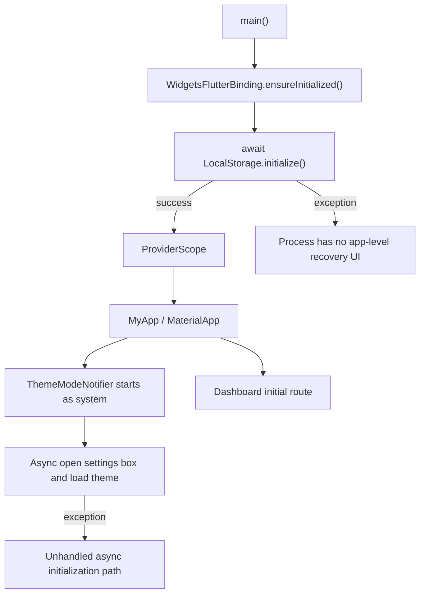
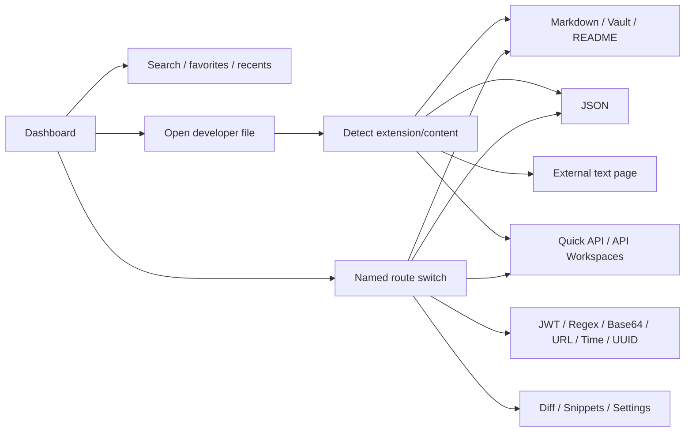
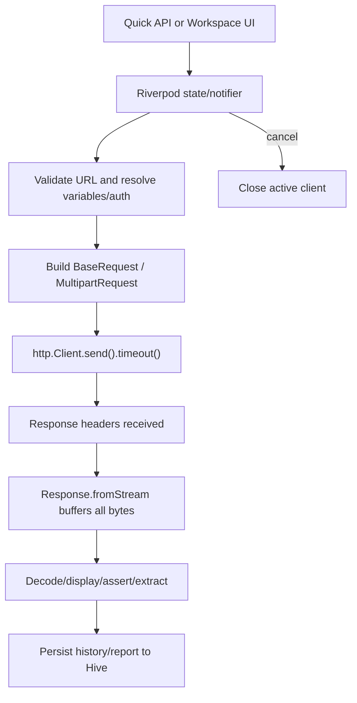
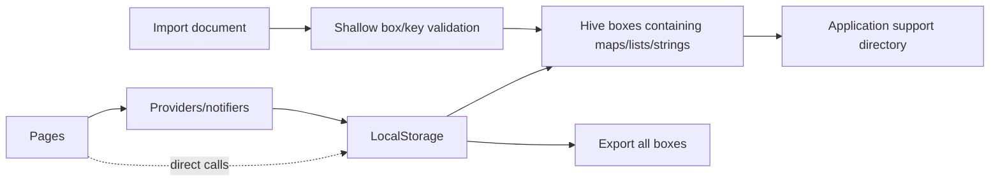
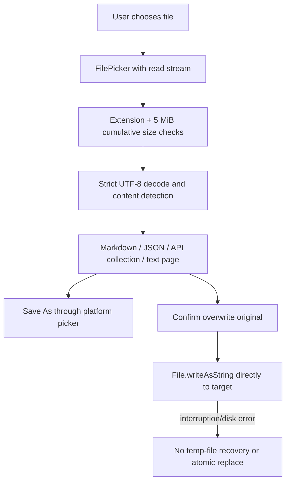
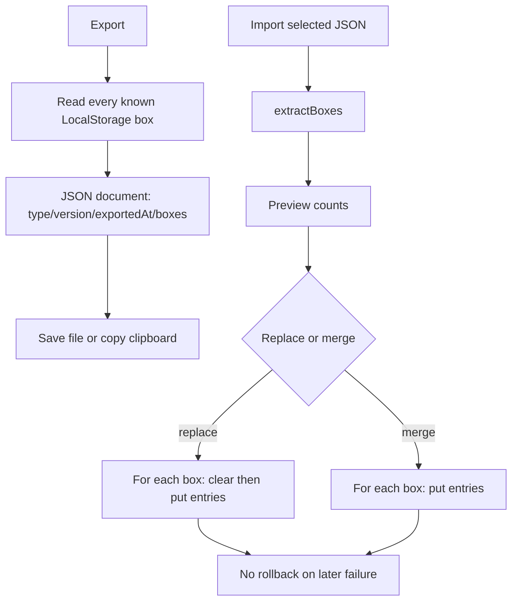
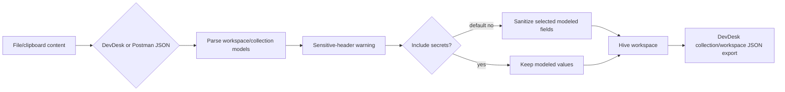

# Architecture and Application Flow

## Technology and repository inventory

| Area | Detected implementation |
| --- | --- |
| UI/runtime | Flutter 3.41.9, Dart 3.11.5, Material 3 |
| State | Riverpod 2.6.1, largely `StateProvider`, `Provider`, and `StateNotifierProvider` |
| Persistence | Hive 2.2.3 / hive_flutter 1.1.0; dynamically serialized maps, no adapters or migrations |
| HTTP | `package:http` 0.13.6, injected client in the quick API path, explicit client lifecycle in workspaces |
| Files | `file_picker`, `dart:io`, UTF-8 decoding, 5 MiB general external-file limit |
| Archive | `archive` 3.6.1 for vault/diff ZIPs |
| Code shape | 146 Dart files and approximately 25,703 Dart lines including tests |
| Tests | 135 passing tests; unit, provider, and widget coverage; no integration-test target |
| Build targets | Android, Windows, web build-verified; iOS/macOS/Linux generated but unverified |

Key folders:

- `lib/app`: root widget, theme state, named-route switch.
- `lib/core`: design tokens, shared widgets, storage, external-file services, and transformation utilities.
- `lib/features`: dashboard, Markdown/vault, README, JSON, API, JWT, regex, Base64, URL, timestamp, UUID, diff, snippets, settings, and external text pages.
- `test`: 27 test files covering 135 cases, with materially uneven production coverage.
- `android`, `windows`, `web`: active build targets; `ios`, `macos`, `linux`: generated platform shells.
- `.artifacts`: tracked generated implementation plan/task/walkthrough. The walkthrough overclaims completed Diff/Git/GitHub/export behavior; these files should not be release evidence.

Twelve Hive boxes are declared in `lib/core/storage/local_storage.dart:11-22`: settings, dashboard, quick API history/environments, API workspaces/history/reports/meta, snippets, Markdown files, vault notes, and vault metadata.

## Actual architecture

The intended shape is feature UI → Riverpod provider → utility/service → Hive/platform. It is not enforced. Examples of presentation-to-platform coupling include `dashboard_page.dart:174`, `api_workspaces_page.dart:295`, `settings_page.dart:211-291`, `vault_page.dart:238`, and `markdown_page.dart:178-190`. These pages call file pickers, `LocalStorage`, `dart:io`, or external-file services directly.

### Application startup

Evidence: `lib/main.dart:13-14`, `lib/app/app.dart:31-46`. Storage failure occurs before `runApp`, so there is no repair/export/reset screen. Theme initialization starts another unguarded asynchronous box read from a notifier constructor.

### Navigation

`lib/app/router.dart` is a centralized named `MaterialPageRoute` switch. Dashboard search lowercases and trims the query, then matches tool name/description (`tool_providers.dart:12-18`). Recent routes are filtered to known routes; loaded favorite routes are not. Persistence writes are optimistic and errors are not surfaced.

### API request execution

The timeout wraps only `send`, not `Response.fromStream` (`api_provider.dart:331-332`, `api_workspace_executor.dart:22,71,83`). Workspace cancellation closes one `_activeClient` (`api_workspace_provider.dart:631-652`), but concurrent invocations can replace that pointer and collection execution does not consistently stop its loop.

### Hive storage

No schema registry, adapter version, migration coordinator, corruption handler, multi-box transaction, or multi-instance lock policy exists. Models use casts in `fromMap`; invalid legacy records can fail entire provider loads.

### External-file open/save

Picker scoping is good and Android does not request broad storage access. The overwrite path at `external_file_service.dart:88-93` does not perform the required writable preflight, temporary write, flush/close, or atomic replacement.

### Backup export/import

`BackupUtils.version` exists but `extractBoxes` does not reject unsupported versions (`backup_utils.dart:36-105`). `LocalStorage.importAll` applies boxes sequentially and clears per box in replace mode (`local_storage.dart:98-120`). Backup preview's `knownBoxes` omits the vault boxes even though the core export includes them.

### API collection import/export

Import sanitation covers modeled secret headers/auth/variables, but not every secret-like URL, body, response, or code-snippet value. Format version compatibility is not enforced. Postman import is shallow and does not reproduce all body/folder modes.

## Provider and dependency map

| Domain | State/provider | Service/utility | Persistence/platform |
| --- | --- | --- | --- |
| Dashboard | `tool_providers.dart` | tool registry | dashboard Hive box |
| Markdown | `markdown_provider.dart`, vault notifier | Markdown renderer, vault parser/export | markdown/vault boxes, file picker, `dart:io`, HTTP URL check |
| JSON | local widget/provider state | `JsonUtils` | optional external files |
| API quick | `api_provider.dart` | validation/snippets | `http.Client`, history/environment boxes |
| API workspace | workspace notifier | resolver/executor/import utils | HTTP and four workspace boxes |
| Snippets | `SnippetsNotifier` | strict map model | snippets box |
| Settings | theme provider plus local page state | backup helpers | all boxes, clipboard, file picker |
| Diff | controller/local page state | text/folder/GitHub/Git services | file system and GitHub HTTP; history is memory-only |

## Platform-specific behavior

- **Android:** System picker through `file_picker`; only INTERNET permission; scoped access is compatible with no broad storage permission. Target/compile SDK 36 and min SDK 24. Direct-path overwrite is generally unavailable for content URIs. Cleartext HTTP is blocked by default for target SDK ≥28, although the UI accepts `http://` without explaining the failure.
- **Windows:** Direct file paths allow overwrite, but make the non-atomic write path release-critical. Window minimum is 900×600. Git process/folder services exist, while the exposed Diff UI only probes Git and does not provide a real repository workflow.
- **Web:** Build succeeds. `dart:io`-dependent behavior is conditional/unavailable, browser downloads replace native save semantics, and arbitrary API endpoints are subject to CORS, mixed-content, credentials, and browser networking restrictions.
- **iOS/macOS/Linux:** Folder presence is not support evidence; no audit build or workflow verification was performed.

## Architectural conclusion

Incremental repair is practical. Introduce boundaries around startup/storage, API execution, file replacement, and backup transactions before broad refactoring. Do not begin with a rewrite or a generic repository layer over every trivial transform.
